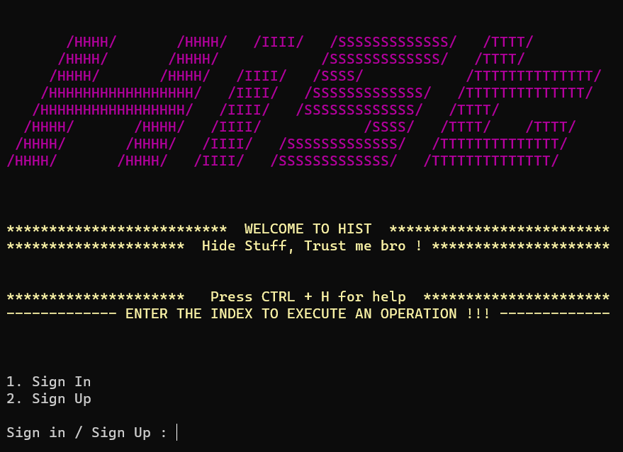
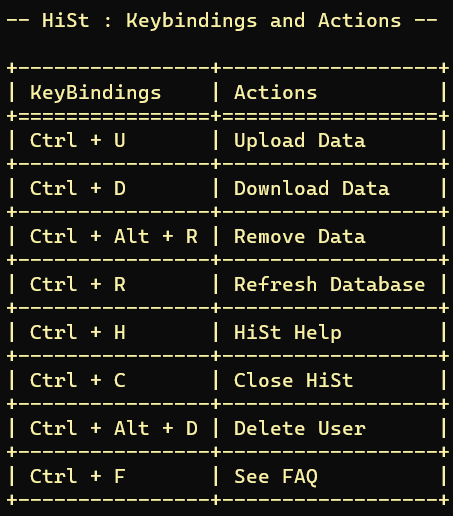
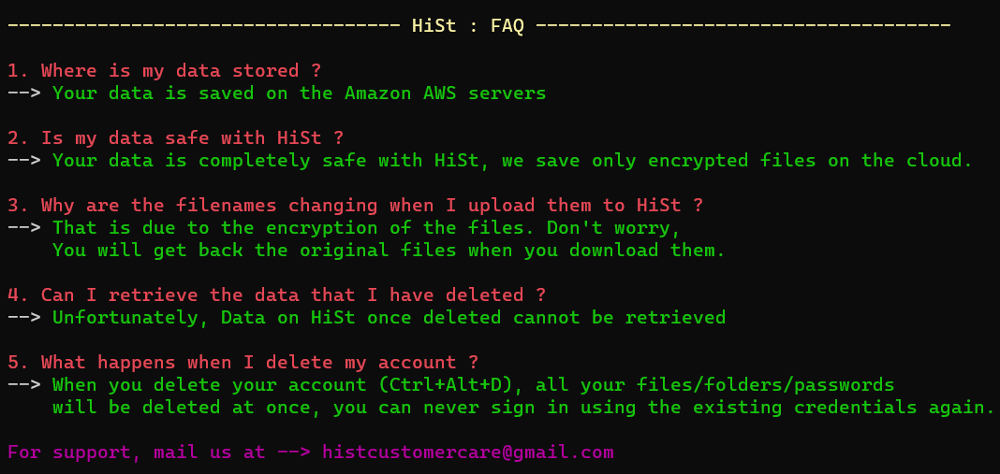
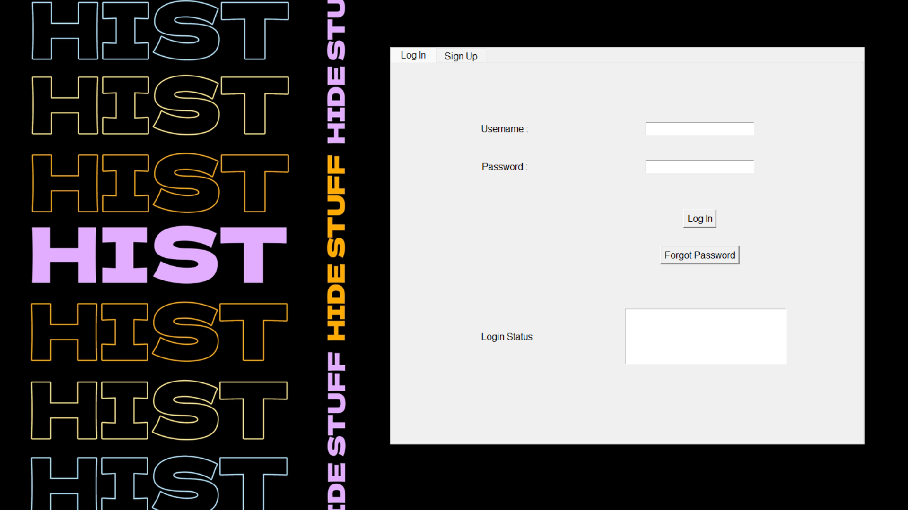
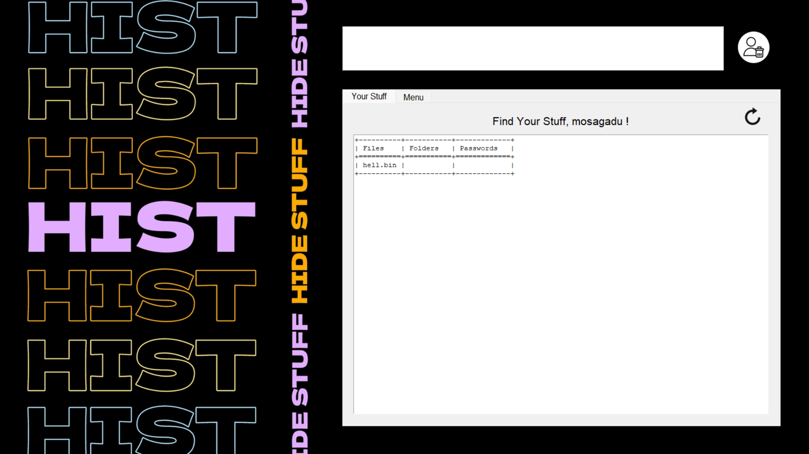
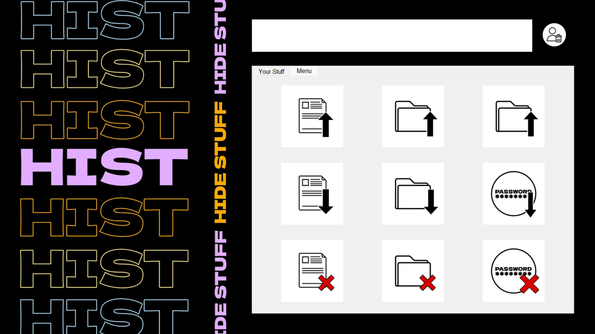

# HiSt - Hide Stuff
 HiSt is a secure password manager and data vault. It uses AES encryption for ensuring data privacy and amazon AWS as the cloud to store the data. Users can upload files, folders and store passwords. 
 
    HiSt does not store the data of users. 
    Everything is securely saved on the AWS cloud. 
 

# Usage

For security reasons, the Source code of HiSt can not be made publicly accessible. Users can install HiSt by downloading the .exe files available in this repository.   

# Command Line Interface for HiSt

HiSt is available both as a CLI and a GUI. This section deals with the usage of the CLI. Users may follow the below mentioned steps and start using the software.

1. Download the HiSt.exe file from the Command Line Interface folder of this repository.
2. Execute the file to open a terminal.

    
3. Press 2 to sign up.
4. After filling in the details, you will be able to upload or download data from AWS secured by HiSt.
5. For a better experience, the CLI is made operable with key bindings. The **Help** menu contains all the key-bindings and their corresponding actions. For better understanding of the software, the FAQ section is added.

    

    
    
    

6. Welcome to **HiSt** 🚀 :)  

# Graphical User Interface for HiSt

1. Unlike the CLI, this wont be console based software. Download the file and execute it. You will find the login window open.

    
2. For a first time usage, users may click on the **Sign-Up** tab to register with us. Existing users may continue logging in in the **Log-in** page.
3. After succesful Sign-up users will be asked to login.
4. Once you login, you will be able to view your uploaded data in the **Your Stuff** tab.

    
5. In the **Menu** tab, users can upload, download data or delete uploaded data.

    
6. Enjoy using **HiSt** 🚀 :)   

# Queries and Feedback

For any Queries and feedback please mail me at addalavenmanoj@gmail.com

**Welcome to the Community.**

*Thank you.*

    
